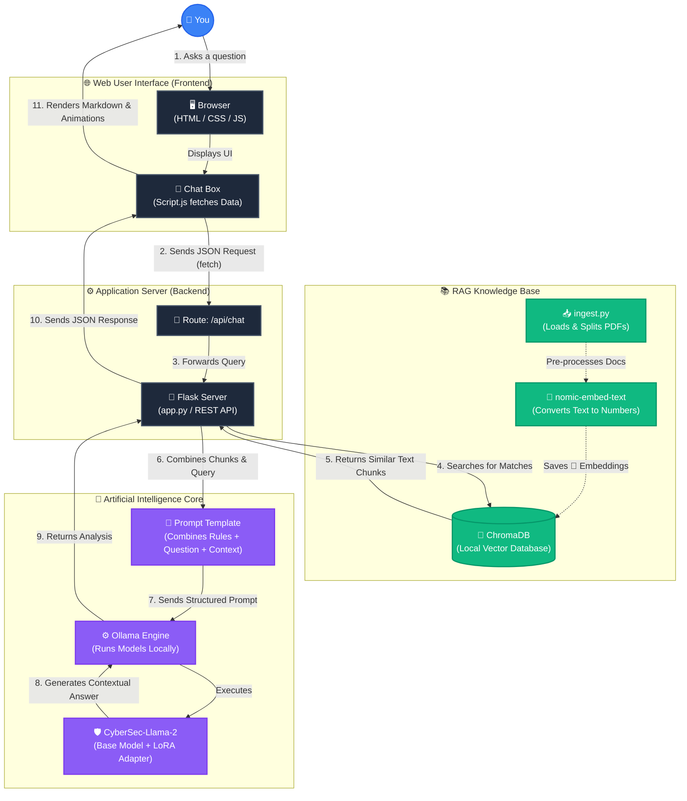

# CyberGuard AI - System Architecture

This diagram illustrates the complete workflow of the AI CyberSecurity Assistant, from when the user types a message in the Web Interface, to how the RAG (Retrieval-Augmented Generation) system pulls data, down to the final AI processing.

## Key Interactions Explained:
- **🟢 RAG Pathway (Green):** Before the AI answers you, the system searches your `chroma_db` for relevant paragraphs from your loaded PDFs.
- **🟣 AI Core (Purple):** The prompt restricts the AI to act specifically as a cybersecurity expert, applying your fine-tuned `LoRA` parameters safely inside the `Ollama` engine.
- **⚪ Web Server (Dark):** The entire process stays fully local and secure via the Python Flask server that ties the Frontend UI to the Deep Learning engines.
