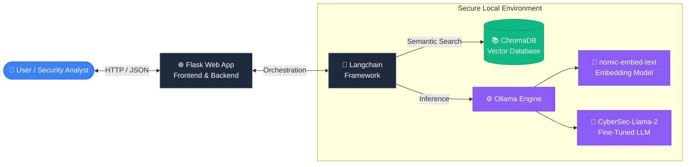
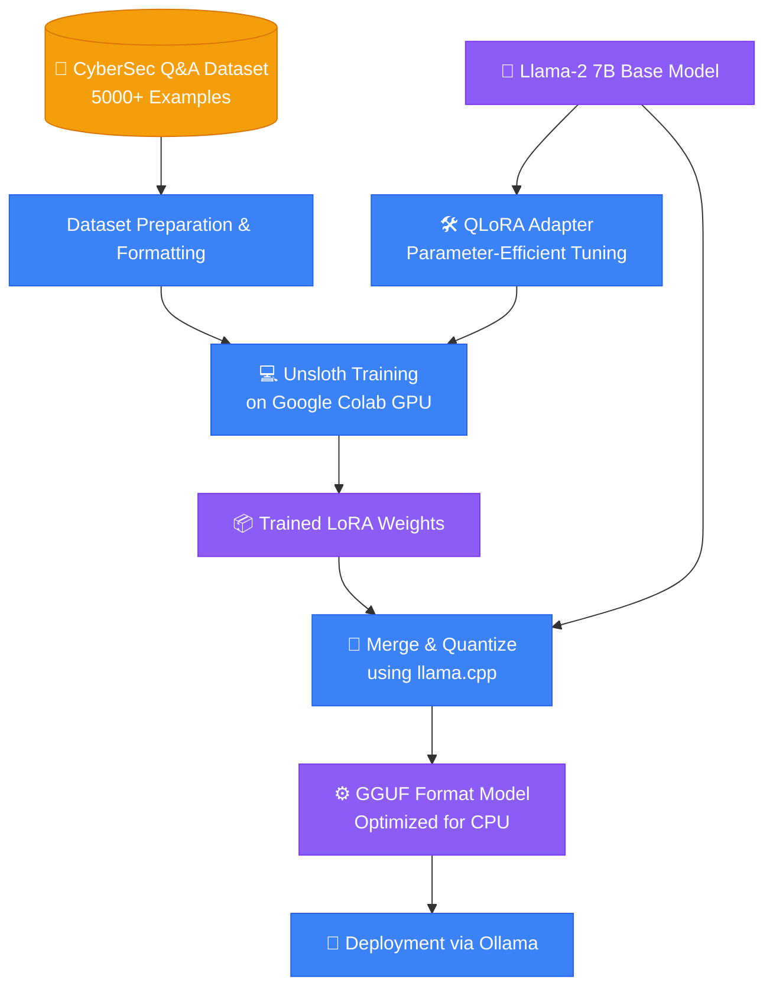
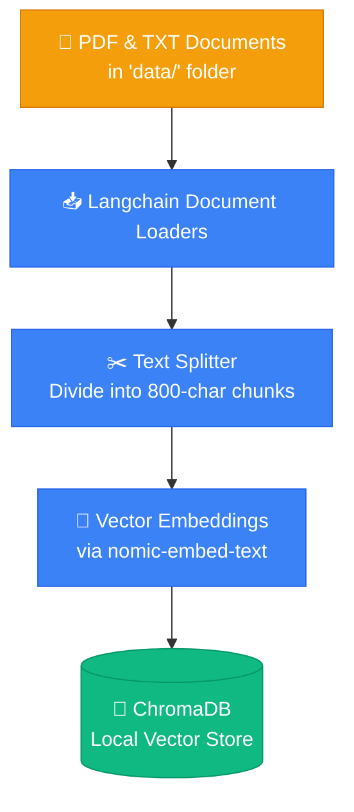
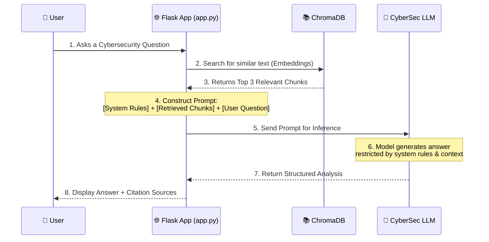

# 📊 عرض المشروع - المخططات والرسومات التوضيحية (Presentation Diagrams)

هذا الملف يحتوي على مجموعة من الرسوم البيانية (Diagrams) المصممة خصيصاً لعرضك التقديمي (Presentation) أمام الأستاذ. هذه المخططات تشرح كيف يعمل النظام من الداخل، وكيف تم بناؤه خطوة بخطوة.

يمكنك تصوير هذه المخططات (Screenshots) أو نسخ الكود الخاص بها إلى مواقع مثل [Mermaid Live Editor](https://mermaid.live/) لتحويلها إلى صور عالية الجودة وإضافتها إلى ملف الـ PowerPoint الخاص بك.

---

## 1. الهيكلة العامة للنظام (High-Level Architecture)
يشرح هذا المخطط المكونات الأساسية للمشروع وكيف تتواصل مع بعضها البعض (واجهة المستخدم، الخادم، قاعدة البيانات، ومحرك الذكاء الاصطناعي).

---

## 2. مرحلة التدريب الدقيق (Fine-Tuning Workflow)
يشرح هذا المخطط كيف قمنا بأخذ نموذج أساسي (Llama-2) وتدريبه ليصبح خبيراً في الأمن السيبراني باستخدام تقنيات حديثة لتقليل استهلاك الموارد.

---

## 3. خط أنابيب استيعاب البيانات (RAG Data Ingestion Pipeline)
يشرح كيف يتم إدخال مستندات الشركة (PDFs/TXTs) إلى النظام لتكوين قاعدة المعرفة الخاصة به.

---

## 4. تدفق معالجة الأسئلة (RAG Query Workflow)
رسم تسلسلي (Sequence Diagram) يوضح خطوة بخطوة ما يحدث منذ أن يسأل المستخدم سؤالاً حتى يحصل على الإجابة المعززة بالمصادر.

---

## 💡 نصائح للعرض أمام الأستاذ:
1. **ركز على الـ RAG:** اشرح للأستاذ أن الميزة القوية في مشروعك هي أنه لا يختلق إجابات، بل يبحث في ملفات حقيقية (PDFs) ويستخرج منها الجواب.
2. **ركز على الخصوصية (Privacy-Preserving):** أشر إلى أن كل شيء يعمل محلياً (Local-first) 100%، ولا يتم إرسال أي بيانات حساسة إلى سيرفرات خارجية (مثل OpenAI)، مما يجعله مثالياً للشركات.
3. **ركز على تقنية التدريب (QLoRA):** وضح كيف استطعت تدريب نموذج عملاق (7 مليار بارامتر) بأقل تكلفة وموارد باستخدام تقنية QLoRA.
